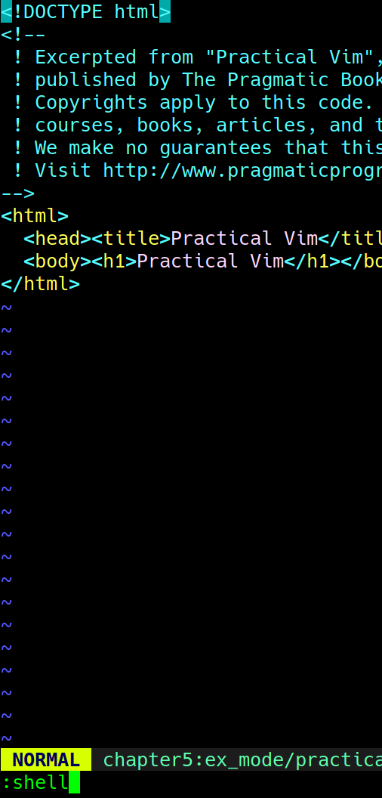

# Vim实用技巧
---


## 目录
[TOC]
## 前言

### Vim 键盘标记
```
:h key-notation
```


## 技巧
### 1.Repeating commands—— . 
```
.
:h .
```
### 2.改变缩进层级—— >、< (p3)(p23)
```
>[Num]G
eg >2G
```

```
>> 等价于 [Tab]
```

### 3.^——Home、$——End

### 4.删除
```
db——反向删除单词
dw——正向删除单词
daw——删除整个单词
d2aw——删除2个单词
```

### 5.大小写转换——g
先vision模式

```
gu
```

```
gU
```

```
g~
```


### 6.查看man——K
光标停在单词哪里

```
K
```


### 7.数学运算—— \<C-r>= <表达式> <CR>
光标显示在需要计算的位置

```
<C-r>= 2*9 <CR>
```


### 8.选择块——\<C-v>
visual Module

### 9.替换——r
visual Module

```
r | <CR>
```


### 10.打印——p
ex Module
```vi
2,9p    ;打印2-9行
```


```
:%p ;打印全文
```


### 11.自动补全——set wildmenu

### 12.运行shell
```
:shell  ;进入bash
$> exit ;退出bash到vim
```



### 13.ctags
```
$> sudo pacman -S ctags
```
